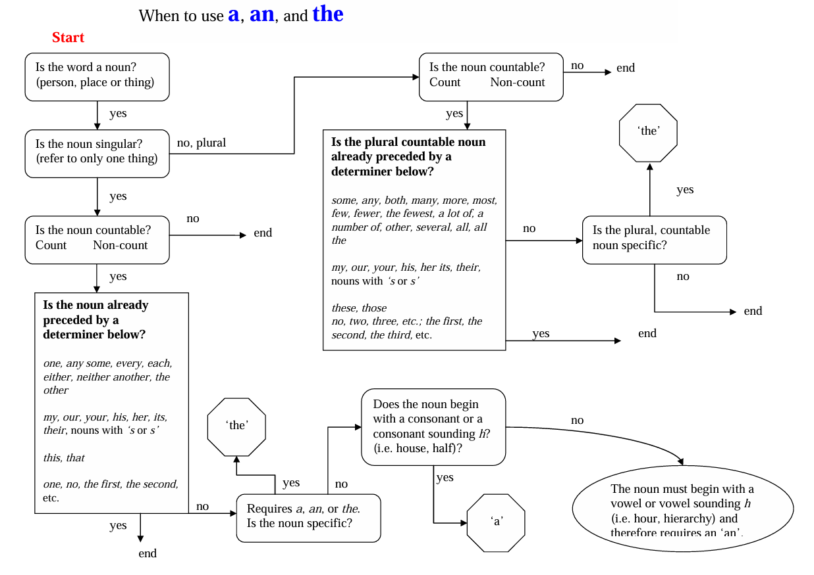

# 📝 The Most Common Habits from More Than 200 English Papers Written by Graduate Chinese Engineering Students

> Based on analysis of **over 200 technical papers** authored by Chinese graduate engineering students  
> By **Felicia Brittman** | [Original Source](http://staff.ustc.edu.cn/~jpq/writing/The%20Most%20Common%20Habits.pdf)
> 📘 **Chinese community interpretation**: [Detailed summary & notes (in Chinese)](https://www.cnblogs.com/luohenyueji/p/16990846.html)

This guide identifies the **most frequent language, grammar, and formatting issues** that obscure clarity and reduce the chances of acceptance in international journals. It is designed to help authors **self-edit effectively**, especially when a native English-speaking editor is unavailable.

The original report has gained wide attention among Chinese researchers and students. A well-known Chinese-language summary and annotation can be found on [CnBlogs](https://www.cnblogs.com/luohenyueji/p/16990846.html).

---

## 🎯 Purpose & Background

Most Chinese universities require master’s and doctoral candidates in engineering to publish **at least one English paper** in an international journal to graduate. However, this is challenging because:

- Prior English training often emphasizes **listening/speaking**, not **technical writing**.
- Many students have **never lived in an English-speaking country**.
- Even native English speakers take **dedicated technical writing courses**.

Papers are often rejected for “poor English.” While hiring editors helps, it’s **costly**, **unsustainable**, and **ineffective** if the editor lacks technical expertise—they may miss **incorrect technical terms** or fail to ensure **technical clarity**.

This report empowers writers to **recognize and correct their own recurring habits**.

---

## 📌 Section 1: Top 10 Critical Issues

### 1. **Missing or Misused Articles (`a`, `an`, `the`)**
- **Why**: Mandarin has no articles.
- **Rule**: Every **singular countable noun** must have a determiner (e.g., `a`, `the`, `my`, `this`).
- **Examples**:
  - ❌ `on surface of main and splitter blades`  
  - ✅ `on **the** surface of **the** main and splitter blades`
  - ❌ `chosen to be **a** 3D modeling tool` (only one tool used)  
  - ✅ `chosen to be **the** 3D modeling tool`

> 💡 See the **Article Decision Flowchart** .


---

### 2. **Very Long Sentences**
- **Problem**: Direct translation from Chinese leads to 60+ word sentences with multiple ideas.
- **Fix**: Limit to **1–2 ideas per sentence**. Use **lists** for parameter/data-heavy content.
- **Example**:
  - ❌ One sentence listing gear grade, gap, nonlinearity, MATLAB block, and initial value.
  - ✅ Break into short sentences or use a bulleted list:
    ```markdown
    - Gear transmission grade: 7  
    - Gear gap: 0.00012 radians  
    - Nonlinearity modeled via phase function method  
    - Initial gap in MATLAB backlash block: 0
    ```

---

### 3. **Prefacing the Main Idea with Purpose/Location/Reason**
- **Issue**: Main subject buried after introductory clauses.
- **Fix**: Put **main subject first**.
- **Examples**:
  - ❌ `For the application in automobile interiors, this paper studies...`  
  - ✅ `This paper studies... for application in automobile interiors.`
  - ❌ `Inside the test box, the space was filled with asbestos.`  
  - ✅ `The space inside the test box was filled with asbestos.`

---

### 4. **Starting Sentences with Time/Condition Phrases**
- **Avoid**: `When...`, `If...`, `Based on...` at the beginning.
- **Better**: Lead with the **key result or figure**.
- **Example**:
  - ❌ `When U is taken as the control parameter, the BDs are shown in Fig. 8.`  
  - ✅ `Figure 8 shows the BDs... when U is taken as the control parameter.`

---

### 5. **Unclear Antecedent for “which”**
- **Problem**: It’s unclear what `which` refers to.
- **Example**:
  - ❌ `The bridge possesses the largest jacking force, which is built in 1978.`  
    → Was the *force* built in 1978?
  - ✅ `The bridge, which was built in 1978, possesses the largest jacking force.`

---

### 6. **Misuse of “respectively”**
- **Correct use**: Only when **two ordered lists** correspond **one-to-one**. Place at **end of sentence**.
- **Common errors**:
  - ❌ `Equations 2–6 can be respectively linearized...`  
  - ✅ `Equations 2–6 can be linearized..., respectively.`
  - ❌ `Measured using two thermocouples respectively.` (no second list)  
  - ✅ `Measured using two thermocouples.`
  - ❌ `Studied before respectively [1–4]`  
  - ✅ `Studied before [1–4].`

> ⚠️ Do **not** use `respectively` if order is obvious or irrelevant.

---

### 7. **Overuse of “In this paper/study”**
- **Limit**: ≤3 times per paper.
- **Appropriate uses**:
  1. In **Introduction/Conclusion** to frame the work.
  2. In **body** to contrast with **others’ work**.
- **Distinguish**:
  - `In this **study**` → refers to the **research activity**.
  - `This **paper** presents...` → refers to the **document**.
- **Example**:
  - ❌ `In this paper, IDEAS was used...`  
  - ✅ `In this study, IDEAS was used...`

---

### 8. **Numbers and Equations in Text**
- **Never start a sentence with a numeral**:
  - ❌ `12 parameters were selected.`  
  - ✅ `Twelve parameters were selected.`
- **Spell out small/general numbers**:
  - ❌ `All 3 studies concluded...`  
  - ✅ `All three studies concluded...`
- **Avoid inline equations**:
  - ❌ `If SOC > SOClo...`  
  - ✅ `If the SOC is greater than SOClo...`

> 📝 Most journals discourage embedding even short math expressions in running text.

---

### 9. **Formatting Issues**
| Issue | Wrong | Correct |
|------|------|--------|
| **Paragraphs** | No indent or single-sentence paragraph | Indent or add blank line |
| **Figure/Table refs** | `Fig.6`, `Figure6` | `Fig. 6` or `Figure 6` |
| **Variables** | `C = 5` | *C* = 5 (italic) |
| **Capitalization** | `The mark...` mid-sentence | `the mark...` |

> 🔸 Be consistent: choose **one style** (e.g., always `Fig.` or always `Figure`).

---

### 10. **Misusing “such as” and “etc.”**
- **Never combine**: `such as A, B, and etc.` → ❌
- **`such as` = incomplete list**; **complete list → use colon**:
  - ❌ `Three characteristics such as X, Y, Z.`  
  - ✅ `Three characteristics: X, Y, and Z.`
- **Correct use of `such as`**:
  - ✅ `Focus on products such as motors and printers.`

---

## 📋 Section 2: Additional Common Mistakes

| Issue | Avoid | Use Instead |
|------|------|-----------|
| **Uncountable nouns** | `equipments`, `literatures` | `equipment`, `literature` |
| **Redundant phrases** | `research work`, `simulation results` | `research`, `results` |
| **Plural agreement** | `different node` | `different **nodes**` |
| **Sentence start** | `8 samples...`, `Fig. 3 shows...` | `Eight samples...`, `Figure 3 shows...` |
| **Phrasing** | `by this way` | `using this method` or `by doing this` |
| **Sentence start** | `How to optimize...` | `Determining how to optimize...` |
| **Verb form** | `results are showed as Fig. 2` | `results are **shown** in Fig. 2` |
| **Tone** | `Obviously, this is novel.` | `This is novel.` |
| **Location terms** | `at home`, `abroad`, `our country` | `in China`, `overseas` |
| **Filler phrases** | `that is to say`, `namely` | Rewrite clearly in one sentence |
| **Informal ending** | `..., too.` | Omit in formal writing |

---

## 📎 Appendix: Article Decision Flowchart (Simplified)

Use this to choose `a` / `an` / `the` / **no article**:

```text
Is it a noun?
 └─ Is it countable?
     ├─ Singular?
     │   ├─ Specific? → "the"
     │   └─ General?
     │       ├─ Starts with vowel sound? → "an"
     │       └─ Starts with consonant sound? → "a"
     └─ Plural?
         ├─ Specific? → "the"
         └─ General? → (no article, or use determiners like "some", "these")

